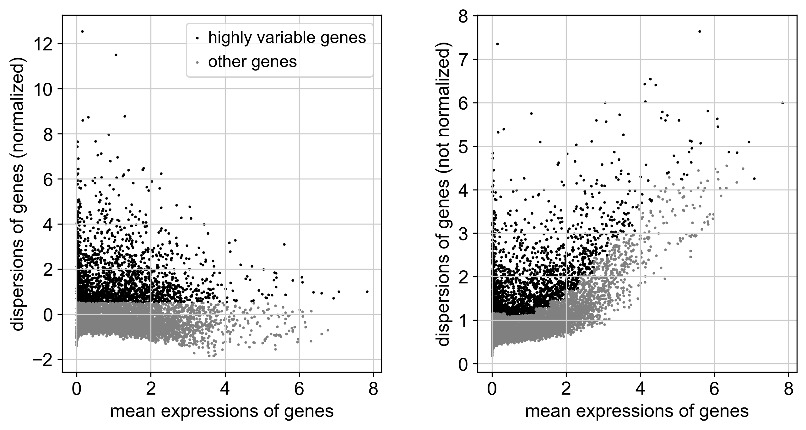
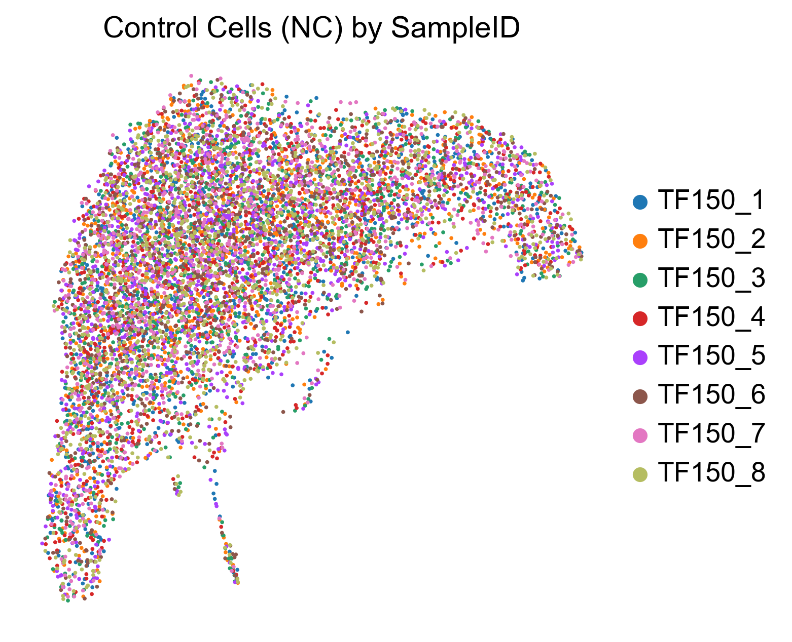
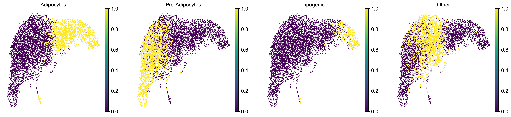

# Batch Effect & Feature Selection Analysis

**Analyst:** Senior Bioinformatician  
**Date:** January 15, 2026  
**Focus:** Quality Control, Feature Selection, and Batch Correction Assessment

## 1. Feature Selection: Highly Variable Genes (HVGs)

To improve the signal-to-noise ratio for downstream dimensionality reduction and perturbation modeling, we selected the top 2,000 Highly Variable Genes (HVGs) using the `seurat` method (dispersion-based selection on log-normalized data).

### Visualization: HVG Selection

**Bioinformatic Interpretation:**
*   **Dispersion vs. Mean:** The plot shows the classic relationship where variance decreases with mean expression. The black points represent the 2,000 selected genes that have higher-than-expected dispersion for their mean expression level.
*   **Biological Relevance:** These genes capture the biological heterogeneity of the system (e.g., cell type markers, cell cycle genes). Excluding the low-variance grey points removes "static" housekeeping genes and technical noise that would otherwise dilute the structure of the latent space.

## 2. Batch Effect Inspection (Negative Controls)

We isolated the **8,705 Negative Control (NC)** cells to inspect technical artifacts. Since these cells received no gene perturbation, they should cluster solely by biological state, not by experimental batch (`SampleID`).

### Visualization: Control Cells by SampleID

**Bioinformatic Interpretation:**
*   **Mixing:** The UMAP shows a high degree of mixing between the 8 different samples (`TF150_1` through `TF150_8`). There are no distinct, separated islands that correspond exclusively to a single sample.
*   **Structure:** The data forms global structures (clusters/trajectories), but this structure is distributed across all samples. This indicates that the primary variance components are biological, not technical.
*   **Conclusion:** **No severe batch effect is observed.** The samples appear to be well-integrated at the level of the control population. Aggressive batch correction (like Harmony) is unnecessary and could potentially over-correct.

### Visualization: Control Cells by Cell State

**Bioinformatic Interpretation:**
*   **Biological Structure:** The "islands" in the UMAP perfectly align with the discrete cell state labels (`adipo`, `pre_adipo`, `lipo`, `other`).
*   **Differentiation Trajectory:** The separation between `pre_adipo` (progenitors) and `adipo` (mature) suggests the dataset captures the differentiation process. The `lipo` (lipogenic) and `other` populations form distinct clusters, validating the phenotypic complexity of the screen.
*   **Validation:** The fact that these biological clusters are clear and consistent across the mixed samples (from the previous plot) firmly establishes that biological signal dominates technical noise in this dataset.

## 3. Next Steps
With Feature Selection complete and Batch Effects ruled out as a major confounder, we are ready to proceed to:
1.  **Perturbation Analysis:** Calculating the shift (distance) of each gene knockout from this control manifold.
2.  **Predictive Modeling:** Training the model to predict the expression of the 2,000 HVGs based on the perturbation labels.
