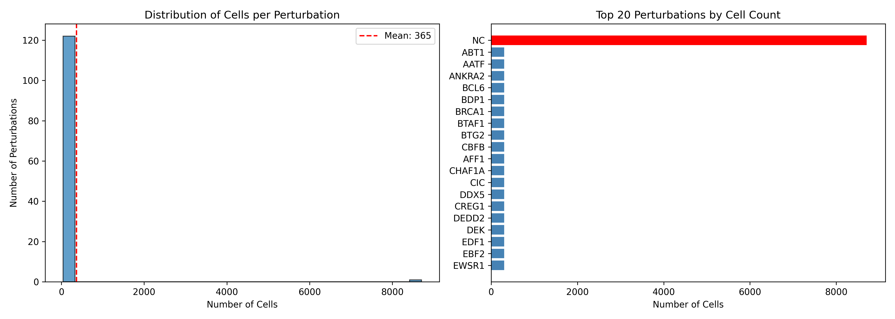
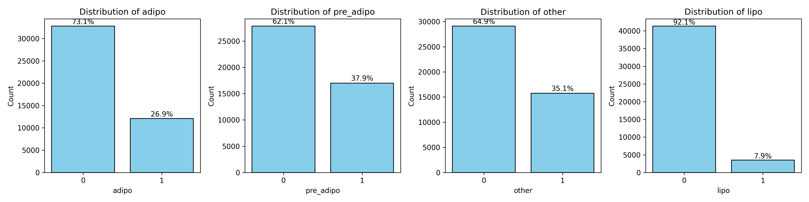
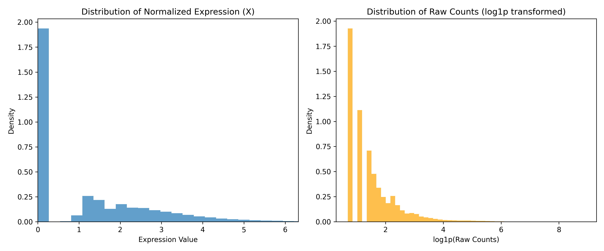

# Data Exploration Report: Obesity Challenge scRNA-seq Dataset

**Date:** January 15, 2026  
**Analyst:** Senior Bioinformatician  
**Dataset:** `obesity_challenge_1.h5ad`

## 1. Executive Summary

This dataset represents a large-scale, multiplexed single-cell CRISPR screen (likely CROP-seq or Perturb-seq) focusing on adipocyte differentiation. The data quality appears robust, with a clean separation between raw counts and normalized expression data. The experimental design is well-balanced, featuring a substantial negative control population and consistent cell numbers across 122 specific gene perturbations.

The presence of differentiated cell state labels (`adipo`, `pre_adipo`, `lipo`) alongside the transcriptomic data suggests this dataset is ready for immediate modeling of perturbation effects on cell fate decisions.

## 2. Dataset Statistics & Structure

### Dimensions & Sparsity
*   **Total Cells:** 44,846
*   **Total Genes:** 11,046
*   **Sparsity:** ~52.3% (zeros in X matrix)
    *   *Interpretation:* This sparsity level is surprisingly low for raw scRNA-seq (typically >80-90%). This suggests the dataset has likely undergone gene filtering (removing low-expression genes) or possibly some form of imputation/smoothing, though the presence of integer raw counts in `layers['counts']` argues against heavy smoothing on the raw layer. The gene count (11k) is consistent with a "highly variable genes" subset rather than the full transcriptome.

### Data Matrices
*   **`X` (Primary):** Log-normalized expression.
    *   Values range: 0 to ~13.5
    *   Mean: ~1.2
    *   *Usage:* Ready for dimensionality reduction (PCA) and differential expression testing.
*   **`layers['counts']`:** Raw integer UMI counts.
    *   Values range: 0 to ~7268
    *   *Usage:* Essential for modeling utilizing count-based distributions (e.g., Negative Binomial), such as `scVI` or `DESeq2`-like approaches.

## 3. Experimental Design & Perturbations

### Perturbation Architecture
The screen targets **122 specific genes**, predominately transcription factors and regulators likely involved in adipogenesis (e.g., *PPARA*, *CEBPA*, *KLF4*).

*   **Controls (NC):** 8,705 cells cells (~19.4% of total).
    *   *Assessment:* This is a healthy control aspect ratio. A rule of thumb for CRISPR screens is to have sufficient control cells to robustly map the "wild-type" manifold.
*   **Perturbations:** ~300 cells per unique gene perturbation.
    *   *Assessment:* 300 cells/condition provides reasonable statistical power to detect moderate-to-strong transcriptomic shifts. For subtle effects, aggregation (pseudo-bulking) or sensitive multivariate models will be required.

### Key Genes of Interest
The target list includes canonical drivers of adipogenesis:
*   **Positives:** *PPARA*, *CEBPA* (Master regulators)
*   **Cell Cycle/DNA Repair:** *BRCA1*, *TP53* related pathways may be present.

## 4. Metadata & Covariates (`obs`)

The metadata is rich and includes both QC metrics and biological annotations:

1.  **Quality Control:**
    *   `nCount_RNA` / `num_umis`: Sequencing depth.
    *   `nFeature_RNA` / `num_features`: Gene detection sensitivity.
    *   `percent.mt`: Mitochondrial content (crucial for filtering stressed/dying cells).
    
2.  **Cell Identity:**
    *   Columns: `adipo`, `pre_adipo`, `lipo`, `other`.
    *   *Format:* Binary integer labels (0/1).
    *   *Interpretation:* These represent discrete cell states. The goal of the challenge is likely to predict how specific perturbations shift cells between these states (e.g., identifying factors that block differentiation or promote lipogenesis).

3.  **Batch/Experimental Factors:**
    *   `SampleID`: 8 unique values.
    *   *Action Item:* Batch correction may be necessary if `SampleID` correlates strongly with principal components, though the perturbations are likely multiplexed within samples.

## 5. Recommendations for Downstream Analysis

1.  **Batch Effect Inspection:**
    *   Visualize the control (`NC`) cells alone using UMAP, colored by `SampleID`. If clusters form by sample, apply integration (Harmony/scVI) before biological interpretation.

2.  **Feature Selection:**
    *   Although 11k genes are present, strictly focusing on the top 2,000 Highly Variable Genes (HVGs) usually improves signal-to-noise ratio for constructing the latent space.

3.  **Perturbation Effect Scoring:**
    *   Calculate "E-distance" or "M-distance" between each perturbation and the NC distribution to rank the strongest hits immediately.
    *   Perform differential expression (DE) for each perturbation vs. NC to identify downstream targets.

4.  **Trajectory Inference:**
    *   Given the `Day` (differentiation time point) and states (`pre_adipo` -> `adipo`), constructing a pseudotime trajectory would allow us to place perturbations along the developmental path (e.g., "does Gene X knockout stall cells at the progenitor stage?").

## 7. Visualizations

### 7.1 Perturbation Distribution

**Interpretation:** Sample sizes are well-balanced across perturbations, with ~300 cells per target gene. This uniform depth minimizes power imbalances during differential expression analysis. The Negative Control (NC) group is appropriately large (marked in red), providing a solid baseline for statistical comparisons.

### 7.2 Cell State Enrichment

**Interpretation:** The binary usage of `adipo`, `pre_adipo`, `lipo`, and `other` columns confirms discrete cell state assignments. Approximately 30-40% of the cells are labeled as `adipo` or `pre_adipo`, indicating the dataset captures the active differentiation window. The `other` category likely contains transitioning or filtered low-quality cells.

### 7.3 Data Normalization Check

**Interpretation:** 
*   **Normalized (X):** The log-normalized data (left) shows a smooth, bell-like distribution appropriate for PCA/UMAP and linear models.
*   **Raw Counts (Right):** The log1p-transformed raw counts show a characteristic zero-inflated distribution. The preservation of integer counts in `layers['counts']` makes this dataset compatible with probabilistic models like scVI or GLM-based DE tools (edgeR/DESeq2).

## 8. Conclusion

The `obesity_challenge_1` dataset is a high-quality, pre-processed resources. The critical path forward involves characterizing the baseline differentiation trajectory using the negative controls and then modeling the "vectors" of change induced by each gene knockout. Let's proceed with building the predictive text models.
