<div align="center">

# 🧬 Adipogenesis Perturbation Atlas

### *Deciphering Cell Fate Through Single-Cell CRISPR Screening*

[](https://www.python.org/downloads/)
[](https://opensource.org/licenses/MIT)
[](https://scanpy.readthedocs.io/)
[](https://www.crunchdao.com)

[**Explore the Data**](1-Explore_training_data/) • [**View Analysis**](3-%20Perturbation_analysis/) • [**Features**](4-%20Gene_regulatory_features/) • [**Documentation**](#-key-analysis-phases)

---

### 📊 **44,846** cells • **123** perturbations • **42** ML features • **2,863** predictions

</div>

---

## 🎯 What is This?

> **Can we predict how deleting a single gene rewrites a cell's destiny?**

This repository provides a **complete end-to-end analysis pipeline** for understanding how gene knockouts affect adipocyte differentiation using single-cell RNA sequencing. Built for the **Broad Institute Obesity Challenge**, this work combines:

- 🔬 **Rigorous Bioinformatics** — Quality control, batch correction, and normalization
- 📈 **Perturbation Profiling** — Quantifying transcriptomic shifts across 123 gene knockouts  
- 🧠 **Feature Engineering** — 42 biologically-validated features for machine learning
- ✅ **Biological Validation** — Hypothesis-driven testing of known adipogenesis biology

**Context:** Obesity affects over 890 million adults globally. Understanding the genetic drivers of adipocyte differentiation is critical for developing new metabolic therapies. This analysis establishes the biological "ground truth" for how specific gene knockouts shift cells between progenitor, adipogenic, lipogenic, and thermogenic states.

---

## ⚡ Quick Start

```bash
# Clone the repository
git clone https://github.com/haythem03/Fatty-scRNAseq.git
cd Fatty-scRNAseq

# Set up environment
python -m venv .venv
source .venv/bin/activate  # Windows: .venv\Scripts\activate
pip install -r requirements.txt

# Run the analysis pipeline
jupyter notebook 1-Explore_training_data/explore_training_data.ipynb
```

<details>
<summary><b>📦 Dependencies</b></summary>

```python
scanpy >= 1.11.5      # Single-cell analysis
pandas >= 2.3.3       # Data manipulation
numpy >= 2.3.5        # Numerical computing
scipy >= 1.17.0       # Scientific computing
scikit-learn >= 1.8.0 # Machine learning
matplotlib >= 3.10.8  # Visualization
seaborn >= 0.13.2     # Statistical plots
```
</details>

---

## 🔄 Pipeline Overview

The following diagram summarizes the four-stage pipeline implemented in this repository, moving from raw data to mechanistic insight and predictive features.

```mermaid
graph TD
    %% --- Sophisticated Bioinformatics Theme ---
    %%{init: {
        'theme': 'base',
        'themeVariables': {
            'primaryColor': '#ffffff',
            'primaryBorderColor': '#2c3e50',
            'primaryTextColor': '#2c3e50',
            'lineColor': '#34495e',
            'tertiaryColor': '#ecf0f1'
        }
    }}%%

    %% --- Node Styling ---
    classDef input fill:#2c3e50,stroke:#34495e,stroke-width:2px,color:#fff,rx:5,ry:5;
    classDef step fill:#fff,stroke:#7f8c8d,stroke-width:1px,color:#2c3e50,rx:2,ry:2;
    classDef highlight fill:#e8f8f5,stroke:#1abc9c,stroke-width:2px,color:#16a085;
    classDef critical fill:#fef9e7,stroke:#f1c40f,stroke-width:2px,color:#d35400,stroke-dasharray: 5 5;
    classDef output fill:#8e44ad,stroke:#8e44ad,stroke-width:2px,color:#fff,shape:rect;

    %% ==========================================
    %% TRACK 1: PRE-PROCESSING & SIGNAL (Top Row)
    %% ==========================================
    subgraph Track1 [<b>TRACK 1: Exploration & Signal Optimization</b>]
        direction LR
        
        Input([🧬 Raw CROP-seq<br/>44k Cells / 11k Genes]):::input
        
        subgraph P1 [Phase 1: QC & State Mapping]
            direction TB
            QC(QC & Filtering<br/>MT% / Depth):::step
            Norm(LogNorm &<br/>Scaling):::step
            States(Cell State ID<br/>Pre-Adipo/Adipo/Lipo/Thermo):::highlight
            
            QC --> Norm --> States
        end
        
        subgraph P2 [Phase 2: Signal Isolation]
            direction TB
            NC{NC Isolation<br/>8,705 Cells}:::critical
            Batch(Batch Effect<br/>Correction):::step
            HVG(Feature Selection<br/>Top 2,000 HVGs):::highlight
            
            NC --> Batch --> HVG
        end

        Input --> QC
        States --> NC
    end

    %% ==========================================
    %% TRACK 2: DYNAMICS & PREDICTION (Bottom Row)
    %% ==========================================
    subgraph Track2 [<b>TRACK 2: Perturbation Dynamics & Feature Engineering</b>]
        direction LR
        
        subgraph P3 [Phase 3: Perturbation Profiling]
            direction TB
            Centroids(Compute KO<br/>Centroids):::step
            Dist{Distance<br/>Metrics}:::critical
            Cluster(Functional<br/>Clustering):::highlight
            
            Centroids --> Dist --> Cluster
        end

        subgraph P4 [Phase 4: Feature Engineering]
            direction TB
            Sig(Signature<br/>Enrichment):::step
            Topo(Network<br/>Topology):::step
            Transfer(k-NN<br/>Transfer):::highlight
            
            Sig & Topo --> Transfer
        end

        FinalOut[["🚀 Predictive Features<br/>(122 Train / 2,863 Test)"]]:::output
        
        Cluster --> Sig
        Transfer --> FinalOut
    end

    %% ==========================================
    %% CONNECTOR (Wrapping the Lines)
    %% ==========================================
    HVG -.->|Expression Matrix| Centroids

    %% Link Styling
    linkStyle default stroke:#34495e,stroke-width:1.5px,fill:none;


```




---

<div align="center">

## 📂 Repository Structure

</div>

```
📁 Fatty-scRNAseq/
│
├── 🔍 1-Explore_training_data/          # Phase 1: Data QC & Trajectory Mapping
│   ├── explore_training_data.ipynb
│   └── DATA_EXPLORATION_README.md
│
├── 🧹 2- Batch_analysis/                # Phase 2: Signal Optimization
│   ├── batch_analysis.ipynb
│   ├── BATCH_ANALYSIS_README.md
│   └── highly_variable_genes.txt       # 2,000 selected HVGs
│
├── 🔬 3- Perturbation_analysis/         # Phase 3: Knockout Profiling
│   ├── perturbation_analysis.ipynb
│   ├── PERTURBATION_ANALYSIS_README.md
│   ├── perturbation_centroids.csv      # 123 × 2,000 HVGs
│   └── perturbation_analysis_summary.csv
│
├── 🧠 4- Gene_regulatory_features/      # Phase 4: ML Feature Engineering
│   ├── gene_regulatory_features.ipynb
│   ├── GENE_FEATURES_README.md
│   ├── training_gene_features_comprehensive.csv  # 122 × 42 features
│   └── test_gene_features_comprehensive.csv      # 2,863 × 42 features
│
├── 💾 Data/                             # Input datasets
│   ├── obesity_challenge_1.h5ad        # 44,846 cells × 11,046 genes
│   ├── signature_genes.csv             # 888 curated markers
│   └── ...
│
└── 📊 figures/                          # High-res visualizations
    ├── perturbation_pca.png
    ├── program_shift_heatmap.png
    └── ...
```

<details>
<summary><b>💡 File Descriptions</b></summary>

| File | Description | Size |
|------|-------------|------|
| `obesity_challenge_1.h5ad` | Main scRNA-seq dataset | 44,846 cells |
| `perturbation_centroids.csv` | Mean expression per knockout | 123 × 2,000 |
| `training_gene_features_comprehensive.csv` | ML-ready training features | 122 × 42 |
| `test_gene_features_comprehensive.csv` | Prediction targets | 2,863 × 42 |

</details>

---

<div align="center">

## 🔬 Analysis Workflow

**Four-phase pipeline from raw data to predictive features**

</div>

| Phase | Objective | Key Outputs | Notebook |
|:-----:|-----------|-------------|----------|
| **🔍 1** | **Data Exploration** | Cell state mapping, QC metrics | [📓 explore_training_data.ipynb](1-Explore_training_data/explore_training_data.ipynb) |
| **🧹 2** | **Signal Optimization** | 2,000 HVGs, batch validation | [📓 batch_analysis.ipynb](2-%20Batch_analysis/batch_analysis.ipynb) |
| **🔬 3** | **Perturbation Profiling** | Effect sizes, functional clusters | [📓 perturbation_analysis.ipynb](3-%20Perturbation_analysis/perturbation_analysis.ipynb) |
| **🧠 4** | **Feature Engineering** | 42 ML features, biological validation | [📓 gene_regulatory_features.ipynb](4-%20Gene_regulatory_features/gene_regulatory_features.ipynb) |


<summary><b>📋 Detailed Phase Descriptions</b></summary>

### Phase 1: Exploratory Data Analysis

**Objective:** Characterize the baseline differentiation landscape.

- **Data:** 44,846 cells × 11,046 genes, 123 perturbations
- **Finding:** Validated a clean separation of cell states, identifying the differentiation trajectory from **pre_adipo** (progenitors) to **adipo** (mature adipocytes), **lipo** (lipogenic/metabolic), and **thermo** (thermogenic/brown fat) cells.
- **Key Metrics:**
  - Mean UMI counts: 3,247 per cell
  - Mitochondrial content: 2.3% (low contamination)
  - 4 distinct cell programs with 888 signature genes

📊 [**View full exploration report →**](1-Explore_training_data/DATA_EXPLORATION_README.md)

### Phase 2: Batch Correction & Feature Selection

**Objective:** Ensure biological signal dominates technical noise.

- **Method:** Isolated 8,705 Negative Control (NC) cells to check for batch artifacts across 8 samples.
- **Finding:** Controls showed high mixing and no severe batch effects (variance explained by batch: 8.3%).
- **Outcome:** Selected **2,000 Highly Variable Genes (HVGs)** based on dispersion to maximize signal-to-noise ratio for downstream modeling.
- **Validation:** HVGs enriched for known adipogenic markers (PPARG, CEBPA, FABP4) and metabolic pathways.

📊 [**View batch analysis report →**](2-%20Batch_analysis/BATCH_ANALYSIS_README.md)

### Phase 3: Perturbation Effect Profiling

**Objective:** Quantify the "physics" of cell fate shifts.

- **Method:** Computed expression centroids for all 123 perturbations and calculated Euclidean/Cosine distances from the NC baseline.
- **Finding:** Identified a **"Checkpoint Model"** of differentiation:
  - **Differentiation Blockers** (e.g., CEBPA): Knockout traps cells in progenitor state
  - **Maturation Accelerators** (e.g., RNASEH2C): Knockout pushes cells into hyper-mature states
  - **Neutral Perturbations** (~30%): Minimal effect, suggesting system robustness

📊 [**View perturbation analysis report →**](3-%20Perturbation_analysis/PERTURBATION_ANALYSIS_README.md)

### Phase 4: Gene Regulatory Feature Engineering

**Objective:** Build biologically-validated features to predict perturbation effects on unseen genes.

- **Method:** Comprehensive feature extraction across 5 categories:
  1. **Signature Enrichment:** Co-expression with program markers
  2. **Expression Profiles:** Program-specific statistics & differentiation ratios
  3. **Network Topology:** Degree centrality, clustering coefficient, neighbor enrichment
  4. **Perturbation Effects:** Direct measurements (training) + k-NN transfer (test)
  5. **Gene Membership:** Binary indicators for signature programs

- **Validation Framework:**
  - ✓ Known markers show expected enrichment (PPARG adipo: 0.357, CEBPA adipo: 0.506)
  - ✓ Gene family coherence (CEBP family CV: 0.13)
  - ✓ Biological hypothesis testing (PPARG diff ratio: 1.34 ✓ upregulated)
  - ⚠️ Discovery: Hierarchical program structure (lipo/thermo are adipo subsets)

- **Output:**
  - **Training set:** 122 genes × 42 features (measured perturbations)
  - **Test set:** 2,863 genes × 42 features (prediction targets)

📊 [**View feature engineering report →**](4-%20Gene_regulatory_features/GENE_FEATURES_README.md)


---

<div align="center">

## 🏆 Key Discoveries

</div>

<table>
<tr>
<td width="50%">

### 🔬 **Biological Insights**

| Discovery | Impact |
|-----------|--------|
| **RNASEH2C Paradox** | 84% ↑ differentiation from DNA repair knockout |
| **Hierarchical Programs** | Lipo/thermo are adipo subtypes, not parallel states |
| **PPARG Master Regulation** | Non-redundant regulator (-0.48 adipo shift) |
| **Network Hubs** | Signature genes 2.3× more interconnected |

</td>
<td width="50%">

### 📊 **Dataset Statistics**

| Metric | Value |
|--------|-------|
| **Total Cells** | 44,846 |
| **Genes** | 11,046 |
| **Perturbations** | 123 knockouts |
| **Controls** | 8,705 NC cells (19%) |
| **HVGs Selected** | 2,000 genes |
| **ML Features** | 42 per gene |

</td>
</tr>
</table>

---

<div align="center">

## 📊 Visualizations

</div>

<table>
<tr>
<td align="center" width="33%">
<br/>
<b>Perturbation Space</b><br/>
<sub>PCA projection of 123 knockouts</sub>
</td>
<td align="center" width="33%">
<br/>
<b>Program Dynamics</b><br/>
<sub>Cell state proportion changes</sub>
</td>
<td align="center" width="33%">
<br/>
<b>Feature Co-variation</b><br/>
<sub>42 ML feature relationships</sub>
</td>
</tr>
</table>

<details>
<summary><b>🎨 View All Visualizations</b></summary>

- **Perturbation Analysis**
  - [Perturbation Dendrogram](figures/perturbation_dendrogram.png) — Functional clustering
  - [Distance Distribution](figures/perturbation_distance_distribution.png) — Effect magnitude
  - [Gene Heatmap](figures/perturbation_gene_heatmap.png) — Expression patterns
  
- **Cell States**
  - [Cell States UMAP](figures/cell_states_nc_umap.png) — Differentiation trajectory
  - [Batch Effect UMAP](figures/batch_effect_nc_umap.png) — Technical validation
  
- **Feature Selection**
  - [HVG Selection](figures/hvg_selection.png) — Variable gene identification
  - [PCA Variance](figures/feature_pca_variance.png) — Explained variance

</details>

---

<div align="center">

## ✅ Biological Validation

**All features validated against known biology**

</div>

| Validation Type | Test | Result |
|----------------|------|:------:|
| **Known Markers** | PPARG shows highest adipo enrichment (0.357) | ✅ |
| **Gene Families** | CEBP family coherent (CV < 0.5) | ✅ |
| **Differentiation** | PPARG ratio: 1.34 (upregulated) | ✅ |
| **Program Specificity** | UCP1 enriched in thermo | ✅ |
| **Network Structure** | Signature genes 2.3× neighbor enrichment | ✅ |
| **Train-Test Alignment** | Feature distributions 0.5-2.0× ratio | ✅ |

<details>
<summary><b>⚠️ Novel Findings</b></summary>

- **Hierarchical Programs**: Lipo/thermo show higher adipo than own-program enrichment
  - **Interpretation**: Not a validation failure—reveals biological hierarchy!
  - Lipogenesis and thermogenesis are downstream specializations of adipocytes
  
- **Co-expression Correction**: Some canonical markers reassigned based on expression
  - Original annotations refined by genome-wide correlation patterns

</details>

---

<div align="center">

## 🚀 Getting Started

</div>

### 📥 Installation

```bash
# Clone repository
git clone https://github.com/haythem03/Fatty-scRNAseq.git
cd Fatty-scRNAseq

# Create virtual environment (recommended)
python -m venv .venv
.venv\Scripts\activate  # Windows
# source .venv/bin/activate  # Linux/Mac

# Install dependencies
pip install scanpy pandas numpy scipy scikit-learn matplotlib seaborn
```

### ▶️ Run Analysis

Execute notebooks **sequentially** to reproduce the full pipeline:

```python
# 1️⃣ Explore training data
jupyter notebook "1-Explore_training_data/explore_training_data.ipynb"

# 2️⃣ Batch analysis
jupyter notebook "2- Batch_analysis/batch_analysis.ipynb"

# 3️⃣ Perturbation quantification
jupyter notebook "3- Perturbation_analysis/perturbation_analysis.ipynb"

# 4️⃣ Feature engineering
jupyter notebook "4- Gene_regulatory_features/gene_regulatory_features.ipynb"
```

### 📝 Output Files

Each phase generates validated outputs:

```
Data/
├── preprocessed_adata.h5ad          # QC-filtered AnnData (Phase 1)
├── hvg_features.csv                 # Selected variable genes (Phase 2)
├── perturbation_pca_coords.csv      # Knockout coordinates (Phase 3)
└── final_features.csv               # 42 ML features (Phase 4)

figures/
└── [15 publication-ready plots]     # See Visualizations section
```

---

<div align="center">

## 🎓 Methodology Highlights

</div>

<table>
<tr>
<td width="50%">

### 🔬 **Biological Rigor**

- ✅ **Known Marker Validation**  
  Canonical genes (PPARG, UCP1, CEBPA) validate correctly

- 🧬 **Gene Family Coherence**  
  Families show consistent enrichment (CV < 0.5)

- 📊 **Network Enrichment**  
  Signature genes 2.3× more connected

- 🎯 **Differentiation Trajectory**  
  Ratios align with expected biology

</td>
<td width="50%">

### ⚙️ **Technical Validation**

- 📐 **Train-Test Alignment**  
  Feature distributions 0.5-2.0× ratio

- 🔄 **Cross-Perturbation Consistency**  
  Program shifts reproducible across batches

- 🎲 **Statistical Significance**  
  Permutation tests (p < 0.05) for all features

- 🧪 **Batch Effect Control**  
  PCA confirms minimal technical variation

</td>
</tr>
</table>

---

<div align="center">

## 📈 Next Steps: Predictive Modeling

</div>

Ready-to-use ML features for regression/classification models:

| Stage | Description | Files |
|-------|-------------|-------|
| **Training** | 122 genes × 42 features (measured perturbations) | [training_gene_features_comprehensive.csv](4-%20Gene_regulatory_features/training_gene_features_comprehensive.csv) |
| **Prediction** | 2,863 genes × 42 features (transfer learning) | [test_gene_features_comprehensive.csv](4-%20Gene_regulatory_features/test_gene_features_comprehensive.csv) |

**Recommended modeling approaches:**
1. Ensemble methods combining enrichment + network + expression features
2. SHAP analysis for biological interpretation of predictions
3. Cross-validation on held-out perturbations

---

<div align="center">

## 🙏 Acknowledgments

</div>

This analysis was conducted for the **Broad Obesity 1 Challenge** hosted by **[CrunchDAO](https://www.crunchdao.com/)**.

**Data provided by:**
- Eric and Wendy Schmidt Center at the Broad Institute
- Broad Diabetes Initiative  
- Massachusetts General Hospital

---

<div align="center">

## 📚 References

</div>

<details>
<summary><b>Key Publications</b></summary>

### Adipogenesis Biology
- Rosen & Spiegelman (2014). *What we talk about when we talk about fat.* **Cell** 156(1-2):20-44
- Cristancho & Lazar (2011). *Forming functional fat.* **Nature Reviews MCB** 12(11):722-734

### scRNA-seq Methods
- Wolf et al. (2018). *SCANPY: large-scale single-cell gene expression data analysis.* **Genome Biology** 19:15
- Stuart & Satija (2019). *Integrative single-cell analysis.* **Nature Reviews Genetics** 20(5):257-272

### CROP-seq Technology
- Datlinger et al. (2017). *Pooled CRISPR screening with single-cell transcriptome readout.* **Nature Methods** 14(3):297-301

</details>

---

<div align="center">

## 📜 Citation & License

</div>

**Author:** [Haythem Mami](https://github.com/haythem03)  
**Date:** January 2026  
**License:** MIT

```bibtex
@misc{mami2026fatty,
  author = {Mami, Haythem},
  title = {Fatty-scRNAseq: Gene Regulatory Feature Engineering for Adipocyte Differentiation},
  year = {2026},
  publisher = {GitHub},
  url = {https://github.com/haythem03/Fatty-scRNAseq}
}
```

---

<div align="center">

### ⭐ If you found this analysis useful, please consider starring the repository!

[](https://github.com/haythem03/Fatty-scRNAseq/stargazers)

**Questions?** Open an [issue](https://github.com/haythem03/Fatty-scRNAseq/issues) or reach out!

</div>


